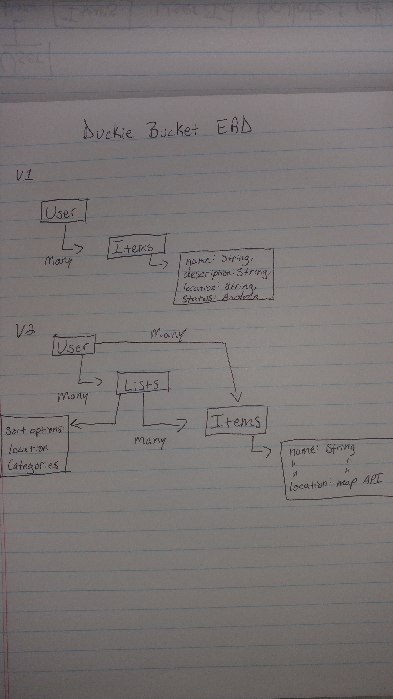

Group Project
Julian Sirkin, Michael Greim, Joseph Petrucci

# Bucket List Express Api

List Api back end database for Bucket List Browser.

Technologies used in this project include Mongodb, Express, bcrypt, body-parser, Mongoose, passport and Heroku

This API recieves requests from cross-origin clients and responds with JSON snippets of User created bucket list items.

# Bucket List Browser Repo:

https://github.com/Fire-Breathing-Rubber-Duck-ies/front-end

## Live Sites:

https://fbrduckies.herokuapp.com \
https://fire-breathing-rubber-duck-ies.github.io/front-end

### Unsolved Issues:

Our duckies do not yet breathe fire. This is an issue for me. There seem to be a few small oversights with margins. Lack of space between sign in, and new user buttons. List item fields appear to be aligned to the top of their cells vs in the center.

## ERD:



## API

Scripts are included in [`scripts`](scripts) to test built-in actions.

#### POST /sign-up

Request:

```sh
curl --include --request POST http://localhost:4741/sign-up \
  --header "Content-Type: application/json" \
  --data '{
    "credentials": {
      "email": "an@example.email",
      "password": "an example password",
      "password_confirmation": "an example password"
    }
  }'
```

```sh
scripts/auth/sign-up.sh
```

Response:

```md
HTTP/1.1 201 Created
Content-Type: application/json; charset=utf-8

{
  "user": {
    "id": 1,
    "email": "an@example.email"
  }
}
```

#### POST /sign-in

Request:

```sh
curl --include --request POST http://localhost:4741/sign-in \
  --header "Content-Type: application/json" \
  --data '{
    "credentials": {
      "email": "an@example.email",
      "password": "an example password"
    }
  }'
```

```sh
scripts/auth/sign-in.sh
```

Response:

```md
HTTP/1.1 200 OK
Content-Type: application/json; charset=utf-8

{
  "user": {
    "id": 1,
    "email": "an@example.email",
    "token": "33ad6372f795694b333ec5f329ebeaaa"
  }
}
```

#### PATCH /change-password/

Request:

```sh
curl --include --request PATCH http://localhost:4741/change-password/ \
  --header "Authorization: Bearer $TOKEN" \
  --header "Content-Type: application/json" \
  --data '{
    "passwords": {
      "old": "an example password",
      "new": "super sekrit"
    }
  }'
```

```sh
TOKEN=33ad6372f795694b333ec5f329ebeaaa scripts/auth/change-password.sh
```

Response:

```md
HTTP/1.1 204 No Content
```

#### DELETE /sign-out/

Request:

```sh
curl --include --request DELETE http://localhost:4741/sign-out/ \
  --header "Authorization: Bearer $TOKEN"
```

```sh
TOKEN=33ad6372f795694b333ec5f329ebeaaa scripts/auth/sign-out.sh
```

Response:

```md
HTTP/1.1 204 No Content
```

### List items

#### POST /items

```sh
curl --include --request POST http://localhost:4741/items \
  --header "Content-Type: application/json" \
  --header "Authorization: Bearer 333desd82dd12rf2eh" \
  --data '{
    "items": {
      "name": "Bungee",
      "description": "Elastic Thrill",
      "location": "From atop a cliff to the rocks below",
      "priority": 10
    }
  }'
```

```sh
scripts/item/create.sh
```

Response:

```md
HTTP/1.1 201 Created
Content-Type: application/json; charset=utf-8

{
  "items": {
    "_id": "IDOBJECT"
    "name": "Bungee",
    "description": "Elastic Thrill",
    "location": "From atop a cliff to the rocks below",
    "priority": 10
  }
}
```

#### GET /items

Request:

```sh
curl --include --request GET http://localhost:4741/items \
  --header "Content-Type: application/json" \
  --header "Authorization: Bearer 333desd82dd12rf2eh" \
```

```sh
scripts/item/index.sh
ID=someId sh scripts/item/show.sh
```

Response:

```md
HTTP/1.1 200 OK
Content-Type: application/json; charset=utf-8

{
  "items": {
    "_id": "IDOBJECT"
    "name": "Bungee",
    "description": "Elastic Thrill",
    "location": "From atop a cliff to the rocks below",
    "priority": 10
  }
}
```

#### PATCH /items/:id

Request:

```sh
curl --include --request PATCH http://localhost:4741/items/ \
  --header "Authorization: Bearer $TOKEN" \
  --header "Content-Type: application/json" \
  --data '{
    "items": {
      "name": "Bungee",
      "description": "Elastic Thrill",
      "location": "From the rocks below to the cliff atop",
      "priority": 1
    }
  }'
```

```sh
TOKEN=33ad6372f795694b333ec5f329ebeaaa scripts/item/update.sh
```

Response:

```md
HTTP/1.1 202 Accepted

{
  "items": {
    "n": 1,
    "nModified":1,
    "ok":1
  }
}

```

#### DELETE /items/

Request:

```sh
curl --include --request DELETE http://localhost:4741/items/ \
  --header "Authorization: Bearer $TOKEN"
```

```sh
TOKEN=33ad6372f795694b333ec5f329ebeaaa scripts/item/destroy.sh
```

Response:

```md
HTTP/1.1 204 No Content
```
